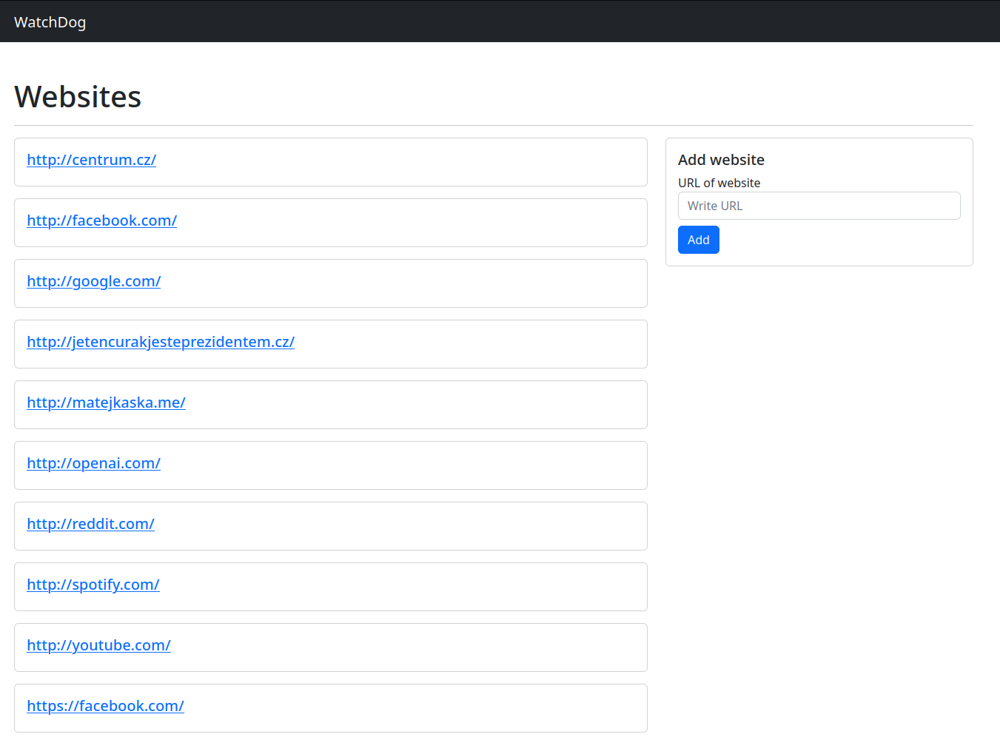
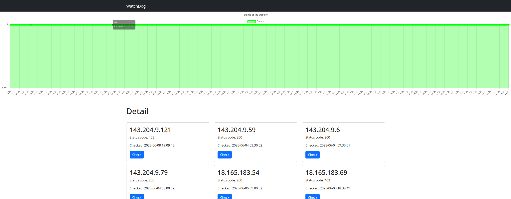
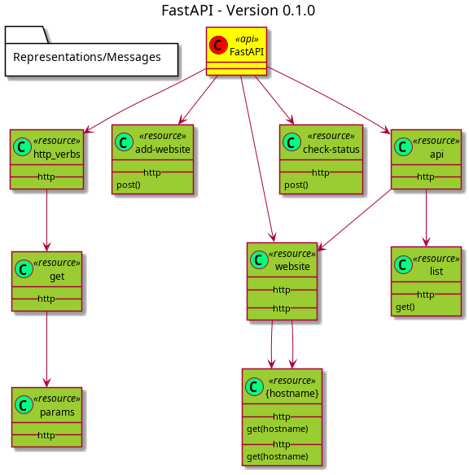

# WatchDog

WatchDog is a simple application designed to monitor the availability of websites by periodically sending requests to servers. Users can add websites and obtain detailed information about their availability, including a timeline graph, returned IP addresses, and server response status codes. The application also allows for verifying the availability and responsiveness of a server for a specific IP address of a website. The software aims to provide users with an overview of their website's availability and information about any potential outages.

## Tech 🛠

**Frontend:** Bootstrap

**Backend:** FastAPI, Uvicorn, MariaDB, SQLAlchemy, Jinja

**Tools:** Docker

## Features 🚀

- Website Monitoring: WatchDog monitors the availability of websites by regularly sending requests to the servers. This ensures that users can stay informed about any downtime or outages.
- Detailed Information: Users can obtain detailed information about website availability, including a graphical representation of the availability over time. This allows for easy tracking and analysis of the website's performance.
- IP Address Tracking: WatchDog provides the ability to view the IP addresses associated with a website. This can be useful for troubleshooting or verifying the server's configuration.
- Server Response Status Codes: Users can access the status codes of the server responses, which indicate whether the server is functioning properly or encountering errors. This information helps diagnose and resolve any issues affecting the website's availability.
- Verification of Server Availability: WatchDog allows users to verify the availability and responsiveness of a server for a specific IP address. This feature ensures that the server is accessible and capable of serving the website content.
- User-Friendly Interface: The application provides a user-friendly interface that makes it easy to add and manage websites, view monitoring results, and access detailed reports. Users can navigate through the app effortlessly and quickly access the information they need.
- Insights and Analytics: WatchDog offers insights and analytics regarding website availability, downtime frequency, and performance metrics. These reports help users gain a comprehensive understanding of their website's performance and identify areas for improvement.

## Installation 🛠

### Your Instance 🔥

Clone my repository:

```bash
  git clone https://github.com/matej-kaska/WatchDog
```

Compose (in root folder):

```bash
  docker compose up -d
```

Now wait until it finishes, and then open <http://localhost:5001> in the web browser of your choice.

### Configured Instance 🔥

Experience the power of WatchDog with our pre-configured instance, already set up with valuable data. Explore the capabilities of our application by visiting <https://swi.boubik.cz/>.

By accessing our pre-configured instance, you can instantly dive into a comprehensive demonstration of WatchDog's features and functionalities. This instance is carefully prepared to showcase the full potential of our application, allowing you to explore various website monitoring scenarios and gain a deeper understanding of its capabilities.

Take advantage of this opportunity to observe real-time data and analysis, enabling you to witness the application's performance in action. The pre-configured instance is populated with informative data, including multiple websites with their respective status codes, response times, and IP addresses.

Please note that this configured instance is for demonstration purposes only. To utilize WatchDog for your specific website monitoring needs, we recommend setting up your own instance and tailoring it to your requirements. Our team is readily available to assist you in this process and ensure seamless integration into your infrastructure.

## User Guide ❤️

### Main Page 📖

The main page of the WatchDog application serves as a centralized hub for monitoring the availability of websites. Upon opening the application, users are greeted with a user-friendly interface that displays a comprehensive overview of all the websites that have already been added to the monitoring list. This overview allows users to quickly assess the status and availability of their websites at a glance.

To further enhance usability, the main page offers an intuitive interface for adding new websites to the monitoring list. Users can easily access the "Add Website" feature, where they can input the necessary details, such as the website's URL. Upon adding a new website, the application will initiate periodic requests to the server to monitor its availability.



### Watched Website 📖

This website page within the WatchDog application provides users with detailed information about a specific website in a comprehensive and organized manner. This page offers valuable insights into the website's availability, including a graphical representation of its uptime status, a list of IP addresses that have responded to requests from the domain, along with their corresponding status codes, and the date and time of the last check.

At the top of the website page, users will find a visually informative graph that depicts the website's availability over a period of time. This graph allows users to easily track any patterns or fluctuations in the website's uptime, providing a clear overview of its overall performance. By analyzing the graph, users can quickly identify periods of downtime or interruptions and take appropriate actions to rectify any issues.

Beneath the graph, the website page displays a list of IP addresses that have responded to requests from the domain. Each IP address entry is accompanied by its corresponding status code, indicating the server's response status (e.g., 200 for a successful response, 404 for page not found, etc.). This list provides users with a comprehensive overview of the different servers for that website, offering insights into potential network or routing issues.



## API UML Diagram 📚



## Contributors 👥

- [Matej Kaška](https://github.com/matej-kaska)
- [Jan Chlouba](https://github.com/Boubik)
- [Jakub Havel](https://github.com/M3chro)
